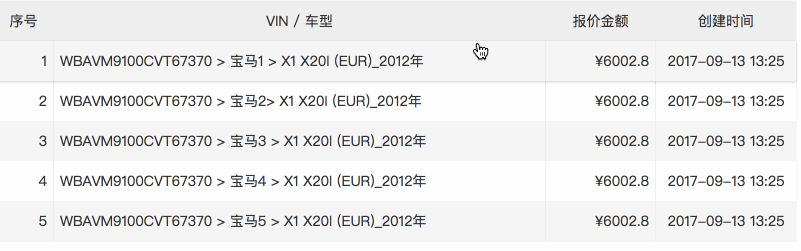

# normal list for react



**install**

`npm install --save-dev normal-list-react style-loader css-loader`

**webpack.config.js**

```
// add loader
{
    test: /\.css$/,
    loader: "style-loader!css-loader"
}
```

**import**

import NormalList from 'normal-list-react'

**use**

```
<NormalList
    data={_normalListData.data}
    headerTitles={['序号', 'VIN / 车型', '报价金额', '创建时间']}
    itemKeys={['num', 'type', 'total_money', 'createtime']}
    listClick={this.listClick.bind(this)}/>
```

> data: data source, array with objects

> headerTitles: header titles

> itemKeys: list item key from object

> listClick: list click handle, callback the item

```
listClick(item) {
    alert(JSON.stringify(item))
}
```
